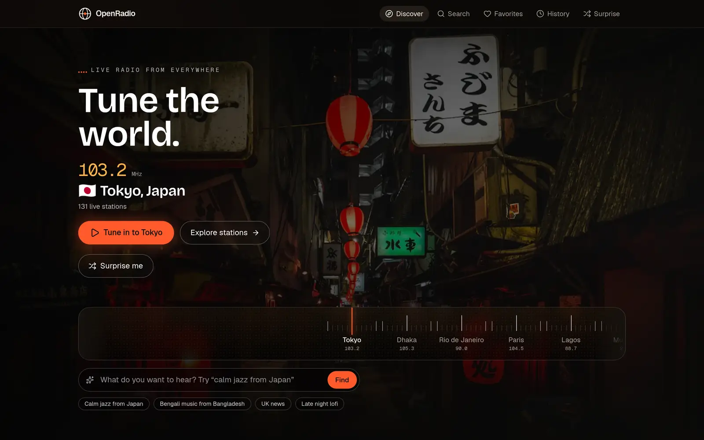
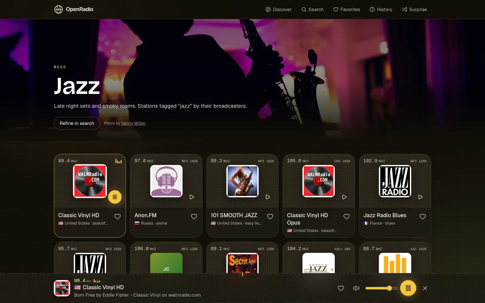
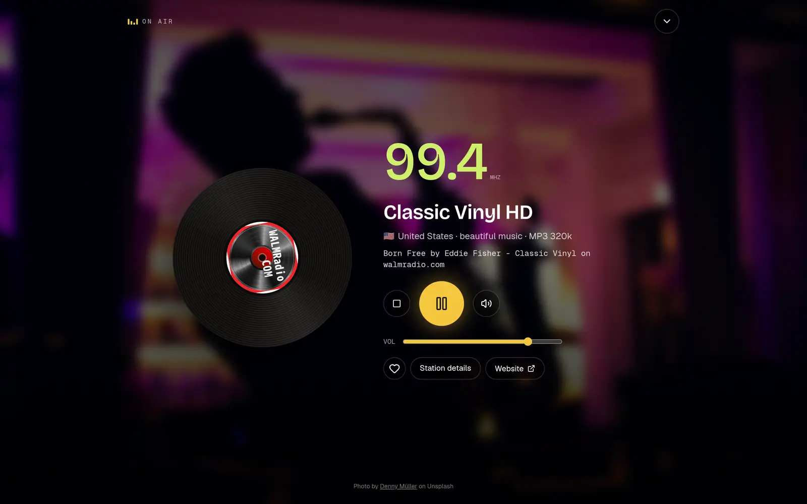
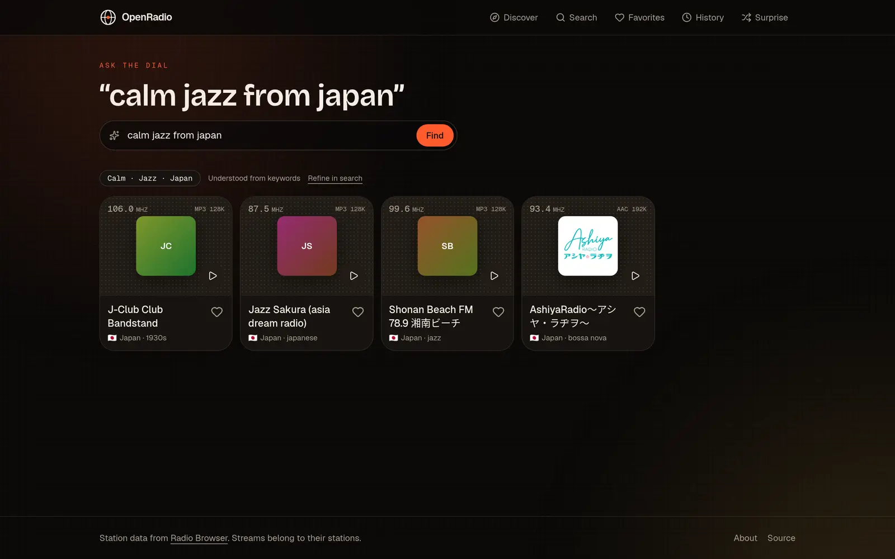

<div align="center">

# OpenRadio

**Explore the world through radio.**

Live radio from every country, language and genre, in one free and open-source player.

[openradio.space](https://openradio.space) · [Contributing](CONTRIBUTING.md) · [Roadmap](docs/roadmap.md) · [Architecture](docs/architecture.md)

[](https://github.com/raj-khan/openradio/actions/workflows/ci.yml)
[](LICENSE)

<!--  -->

[openradio-promo.webm](https://github.com/user-attachments/assets/35633b56-2a41-4809-92d2-818328d55cf8)

</div>

## Why this exists

This is a personal project, built for the joy of building it. I wanted one calm, beautiful place to hear what the rest of the world is listening to right now, without ads, accounts or tracking. It is open source so anyone can run it, learn from it or make it better. **Contributions are very welcome.**

## What it does

- **Tune the world.** Turn a radio dial across cities and hear a live station from that country instantly.
- **Ask for what you want.** Type "calm jazz from Japan" or "Bengali music from Bangladesh" and get real stations. Works on keywords alone; AI is optional.
- **Browse by place, language, mood or genre**, with over 45,000 stations from the Radio Browser directory.
- **Surprise me.** One button, somewhere unexpected.
- **The interface follows the music.** A jazz station makes the app calm and amber; a dance station turns it electric. Colors always keep accessible contrast.
- **Now playing** song titles when a station broadcasts them, plus lock screen and media key control.
- **Favorites and history** stored on your device. No account, no tracking.
- **Installable** as an app, and it keeps working offline for browsing what you already visited.

| Browse and play                                                                               | Now playing                                                                                                         | Ask for a vibe                                                                                          |
| --------------------------------------------------------------------------------------------- | ------------------------------------------------------------------------------------------------------------------- | ------------------------------------------------------------------------------------------------------- |
|  |  |  |

## Quick start

```bash
git clone https://github.com/raj-khan/openradio.git
cd openradio
npm install
npm run dev
```

Open http://localhost:3000. No API keys or database needed: station data comes from the public [Radio Browser](https://www.radio-browser.info) API.

### Optional configuration

Copy `.env.example` to `.env.local` and fill in what you need:

| Variable                 | What it does                                                               |
| ------------------------ | -------------------------------------------------------------------------- |
| `NEXT_PUBLIC_APP_URL`    | Public origin used for metadata, sitemap and robots                        |
| `RADIO_BROWSER_BASE_URL` | Pin a specific Radio Browser mirror                                        |
| `AI_GATEWAY_API_KEY`     | Enables AI understanding on `/discover` (keyword parsing works without it) |
| `AI_MODEL`               | Model for discovery, as `provider/model`                                   |

### Scripts

| Command                              | What it runs                                      |
| ------------------------------------ | ------------------------------------------------- |
| `npm run dev`                        | Development server                                |
| `npm run build` / `npm start`        | Production build and server                       |
| `npm run lint` / `npm run typecheck` | ESLint and TypeScript                             |
| `npm test`                           | Unit tests (Vitest)                               |
| `npm run test:e2e`                   | End to end tests (Playwright, mocked station API) |
| `npm run format`                     | Prettier                                          |

## How it is built

Next.js 16 (App Router) and React 19 in TypeScript, Tailwind CSS v4, Zustand for player state, hls.js for HLS streams, Zod for validation, Vitest and Playwright for tests. No database: favorites and history live in your browser.

Station data flows through a `StationProvider` interface, so Radio Browser can be swapped or joined by other directories later. Audio is never proxied, recorded or rebroadcast: your browser connects straight to each station.

See [docs/architecture.md](docs/architecture.md) for the full picture and [docs/design.md](docs/design.md) for the visual direction.

## Roadmap

**Now:** the web app, installable and offline capable.
**Next:** landing pages for genre and country pairs, structured data, a world map, sleep timer, collections and translations.
**Later:** apps with a shared core for macOS, Windows and Linux, Android and iOS, plus a Chrome extension.

Full list in [docs/roadmap.md](docs/roadmap.md). Want to lead one of the apps? Open an issue and say hello.

## Contributing

Issues, ideas and pull requests are welcome, especially around station quality, translations, accessibility and design. Start with [CONTRIBUTING.md](CONTRIBUTING.md) and the task list in [`backlog/`](backlog/).

## Credits and license

Station data from [Radio Browser](https://www.radio-browser.info). Photography from [Unsplash](https://unsplash.com) under the Unsplash License, credited on the [about page](https://openradio.space/about). OpenRadio does not host or rebroadcast audio; streams, names and logos belong to their stations.

Released under the [MIT License](LICENSE).
